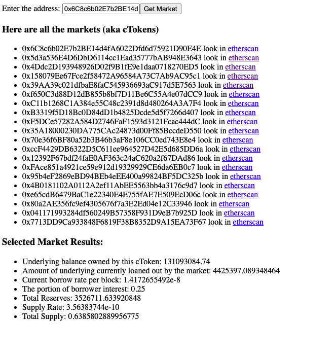

# Example Usage of Compound

In this project I've tried to show how can you interact with the Compound contracts.

I am too lazy to add lend/borrow properties to this site, because no one going to use it. So, if you want, you can add account based functions too.

Here it is how it looks like:

